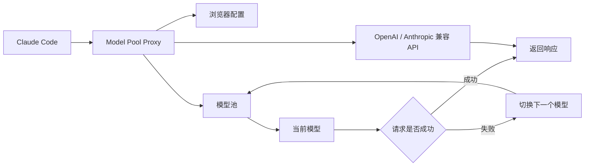
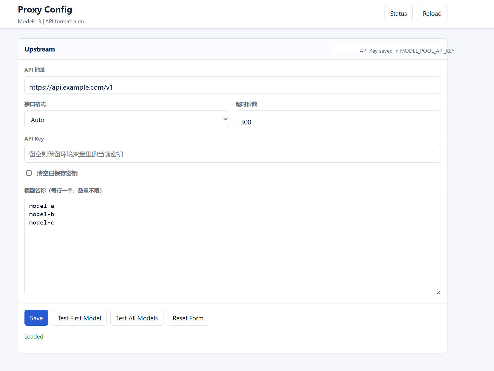

<h1 align="center">Model Pool Proxy</h1>

<p align="center">
  
  
  
  
  
  
</p>

> 本地 AI API 模型池代理，支持 OpenAI / Anthropic 兼容接口、浏览器配置、模型检测与自动故障切换。

Model Pool Proxy 用于把 Claude Code 的请求转发到用户配置的 OpenAI 兼容或 Anthropic 兼容上游接口。它维护一个模型池，支持批量检测模型，并在当前模型不可用时自动切换到下一个可用模型。

它适合用于本地开发场景：Claude Code 只连接一个稳定的本地地址，而上游 API 地址、API Key、接口格式和模型列表都可以通过浏览器配置页管理。

English Summary: Model Pool Proxy is a local AI API proxy with OpenAI/Anthropic-compatible routing, browser-based configuration, model testing, and automatic model-pool failover.

## 背景

很多 AI API 平台会提供试用额度或免费额度，但这些额度往往分散在不同平台、不同模型之间。实际开发时，单个模型可能因为额度耗尽、限流、不可用或临时错误而中断使用，手动切换模型、修改接口配置和重启工具都比较繁琐。

Model Pool Proxy 的初衷是把多个可用模型统一管理为一个本地模型池。客户端只需要连接本地代理，由代理负责请求转发、失败检测和自动切换模型，从而减少手动切换模型和反复调整配置的成本。

## 项目概览



## 界面预览

### 配置页



## 功能特性

- 本地代理地址，默认监听 `http://127.0.0.1:19190`
- 浏览器配置页，支持填写 API 地址、API Key、接口格式、超时时间和模型列表
- 动态模型池，模型数量不写死
- 当前模型不可用时自动切换到下一个模型
- 支持批量检测所有已填写模型
- 支持从模型列表中删除检测失败的模型
- 兼容 Anthropic Messages API 和 OpenAI Chat Completions 接口
- API Key 推荐保存到用户环境变量，不写入 `config.json`
- 本地持久化当前模型、禁用模型、失败原因、使用计数和切换事件
- 提供 Windows 看门狗脚本，可在登录后自动保持代理运行

## 工作方式

Claude Code 只需要连接本地代理。代理会把请求中的模型改写为当前上游模型，然后转发到配置的 API 服务。

```text
Claude Code -> Model Pool Proxy -> Upstream AI API
```

当当前模型出现认证失败、额度不足、模型不存在或模型不可用等问题时，代理会禁用该模型并切换到下一个可用模型。网络错误、超时和临时 5xx 响应会被视为临时故障，不会永久禁用模型。

## 环境要求

- Windows 10/11
- PowerShell 5+
- Python 3.9+
- Git，用于从仓库克隆项目
- Claude Code，如果要把本项目作为 Claude Code 的本地 API 代理
- 一个 OpenAI 兼容或 Anthropic 兼容的上游 API Key

服务端只使用 Python 标准库，不需要安装额外 Python 依赖。

## 安装和启动

克隆仓库：

```powershell
git clone https://github.com/jiadianshui666/model-pool-proxy.git
cd model-pool-proxy
```

复制本地配置文件：

```powershell
Copy-Item .\config.example.json .\config.json
```

启动代理：

```powershell
.\start_proxy.ps1
```

打开状态页：

```text
http://127.0.0.1:19190/
```

打开配置页：

```text
http://127.0.0.1:19190/config-ui
```

## 配置说明

本地运行配置保存在 `config.json`。这个文件用于保存你的私有配置，不应该提交到 Git 仓库。

示例：

```json
{
  "api_key_env": "MODEL_POOL_API_KEY",
  "base_url": "https://your-api-endpoint.example.com/v1",
  "api_format": "auto",
  "bind_host": "127.0.0.1",
  "port": 19190,
  "timeout_seconds": 300,
  "models": [
    "model-a",
    "model-b",
    "model-c"
  ]
}
```

字段说明：

- `api_key_env`：保存上游 API Key 的环境变量名
- `base_url`：上游 API 地址
- `api_format`：接口格式，可选 `auto`、`anthropic` 或 `openai`
- `bind_host`：本地监听地址，通常使用 `127.0.0.1`
- `port`：本地代理端口
- `timeout_seconds`：上游请求超时时间
- `models`：模型池列表，按顺序尝试，数量不限

## API Key 管理

推荐通过配置页填写 API Key。

保存后，Model Pool Proxy 会把密钥写入 `api_key_env` 指定的 Windows 用户环境变量，例如：

```text
MODEL_POOL_API_KEY
```

API Key 不会写入 `config.json`。如果 API Key 输入框留空并保存，表示保留当前环境变量里的密钥；如果选择清空密钥，则会删除对应环境变量。

## Claude Code 配置

把 Claude Code 指向本地代理：

```json
{
  "env": {
    "ANTHROPIC_BASE_URL": "http://127.0.0.1:19190",
    "ANTHROPIC_AUTH_TOKEN": "local-proxy",
    "ANTHROPIC_MODEL": "local-proxy",
    "ANTHROPIC_SMALL_FAST_MODEL": "local-proxy"
  },
  "model": "local-proxy"
}
```

配置完成后，上游模型切换由 Model Pool Proxy 处理。通常情况下，代理切换模型不需要重启 Claude Code。

## 常用管理

常用命令：

```powershell
.\start_proxy.ps1
.\status_proxy.ps1
.\stop_proxy.ps1
```

安装 Windows 登录后自动拉起的看门狗：

```powershell
.\install_startup_watchdog.ps1
```

卸载看门狗：

```powershell
.\uninstall_startup_watchdog.ps1
```

本地管理接口：

- `GET /health`：健康检查
- `GET /status`：文本状态
- `GET /status.json`：JSON 状态
- `POST /next`：手动切换到下一个模型
- `POST /enable-all`：恢复所有被禁用模型
- `POST /config/test`：测试配置页提交的模型

## 安全说明

仓库已经配置 `.gitignore`，避免提交本地运行文件：

- `config.json`
- `state.json`
- `logs/`
- `proxy.pid`
- `.env`
- 本地快捷方式
- 密钥和证书文件

不要提交真实 API Key、私有上游 API 地址、私有模型列表、本机 Claude 配置或运行日志。

## 故障排查

如果代理启动失败，查看错误日志：

```powershell
Get-Content .\logs\server.err.log -Tail 80
```

如果 Claude Code 无法连接，先确认代理是否健康：

```powershell
Invoke-WebRequest -UseBasicParsing http://127.0.0.1:19190/health
```

如果模型切换状态异常，可以打开状态页并使用 `Enable All` 恢复被禁用的模型：

```text
http://127.0.0.1:19190/
```

## License

MIT License. See `LICENSE` for details.
